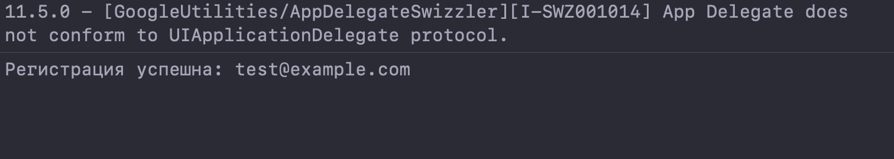
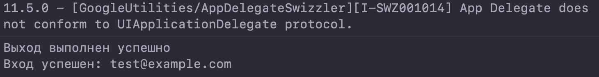
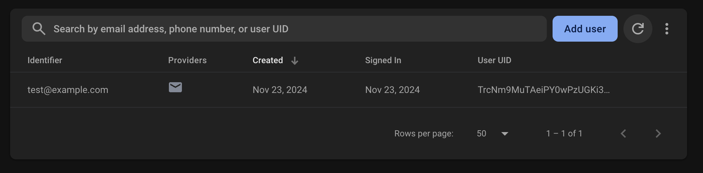

# README: FirebaseService и его тестирование

### Описание задачи:
Реализовать возможность создания аккаунта, входа в аккаунт и выхода из него


## Реализация

### 1. **FirebaseService**
Этот класс инкапсулирует основную логику работы с аутентификацией Firebase. Включает следующие функции:

#### a. `register(email:password:completion:)`
- Регистрирует нового пользователя с использованием Firebase Authentication.
- Параметры:
  - `email`: Электронная почта пользователя.
  - `password`: Пароль пользователя.
  - `completion`: Замыкание, которое возвращает тип `Result`, содержащий либо `AuthDataResult`, либо ошибку.

#### b. `logIn(email:password:completion:)`
- Выполняет вход в аккаунт Firebase.
- Параметры:
  - `email`: Электронная почта пользователя.
  - `password`: Пароль пользователя.
  - `completion`: Замыкание, которое возвращает тип `Result`, содержащий либо `AuthDataResult`, либо ошибку.

#### c. `logOut(completion:)`
- Выполняет выход из аккаунта Firebase.
- Параметры:
  - `completion`: Замыкание, которое возвращает тип `Result`, содержащий либо успех (`Void`), либо ошибку.

---

### 2. **FirebaseServiceTester**
Класс для тестирования методов `FirebaseService`. Содержит три теста:

#### a. `testRegister()`
- Проверяет регистрацию нового пользователя.
- Регистрирует пользователя с заданным email и паролем.

#### b. `testLogIn()`
- Проверяет вход в аккаунт с ранее зарегистрированными данными.

#### c. `testLogOut()`
- Проверяет выход из аккаунта.

#### d. `runTests()`
- Последовательно выполняет все три теста.

---

### 3. **MoneyManagerApp**
Точка входа в приложение (файл `MoneyManagerApp.swift`):

- Инициализирует Firebase при старте через `FirebaseApp.configure()`.
- Запускает тесты `FirebaseServiceTester` в методе `init()`.

```swift
import SwiftUI
import Firebase
@main
struct MoneyManagerApp: App {
    init() {
        FirebaseApp.configure()
        let tester = FirebaseServiceTester()
        tester.runTests()
    }
    var body: some Scene {
        WindowGroup {
            EmptyView()
        }
    }
}
```
### Примечание
Данные тестов выводятся в консоль Xcode.


## Скриншоты тестов и консоли Firebase
**Регистрация**


**Выход и вход**


**Тестовый пользователь в Firebase**

